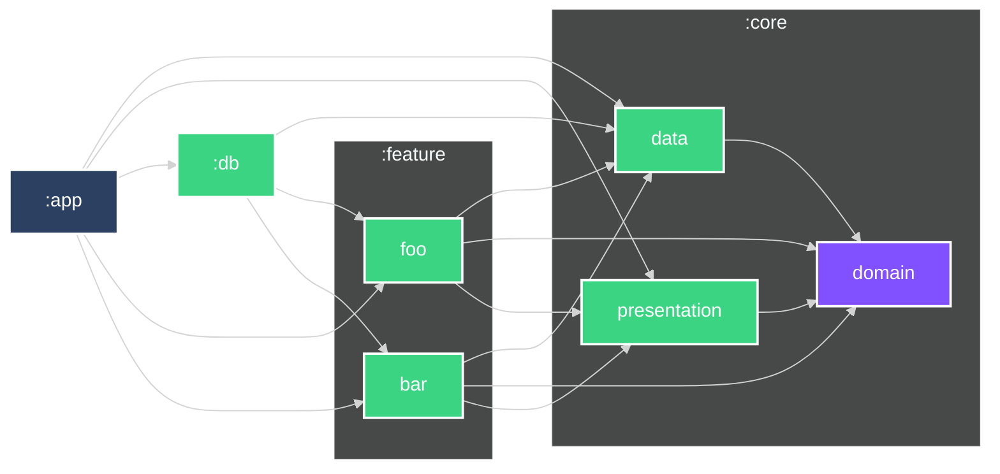

### Module Graph



- - -

Created by [iurysza/module-graph](https://github.com/iurysza/module-graph)

Configs:
```kotlin
moduleGraphConfig {
    readmePath.set("./GRAPH.md")
    heading = "### Module Graph"
    setStyleByModuleType.set(true)
    rootModulesRegex.set(".*app.*")
    theme.set(Theme.DARK)
}
```
