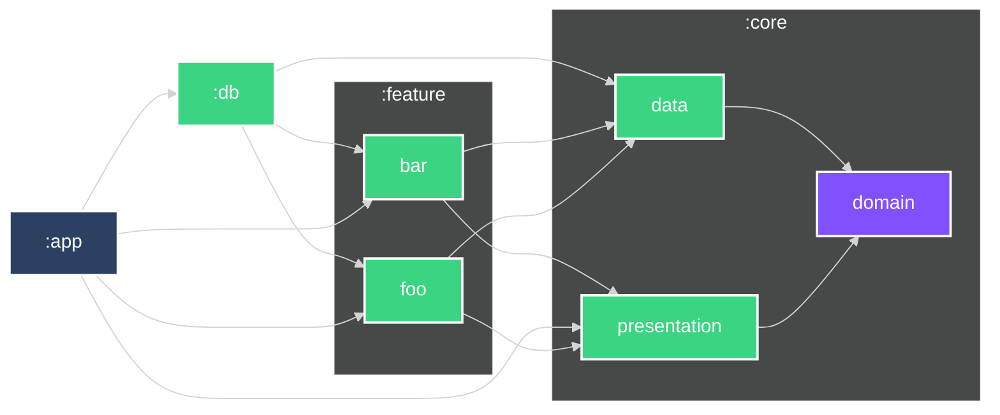

# Boilerplate-Android

Разбор проекта разделен на серию статей:

- [Single Activity с Navigation Component. Или как я мучался с графами. Boilerplate ч. 1](https://habr.com/ru/post/654599/)
- [Запросы в сеть с Clean Architecture и MVVM. Boilerplate ч. 2](https://habr.com/ru/post/667026/) [НЕ АКТУАЛЬНО]
- [Запросы в сеть с Clean Architecture — Обработка ошибок с сервера. Boilerplate ч. 3](https://habr.com/ru/post/673180/)
- [Запросы с пагинацией с помощью Paging 3 и работа над ошибками. Boilerplate ч. 4](https://habr.com/ru/post/682120/) [НЕ АКТУАЛЬНО]

- - -

#### [Modules Graph:](GRAPH.md)

